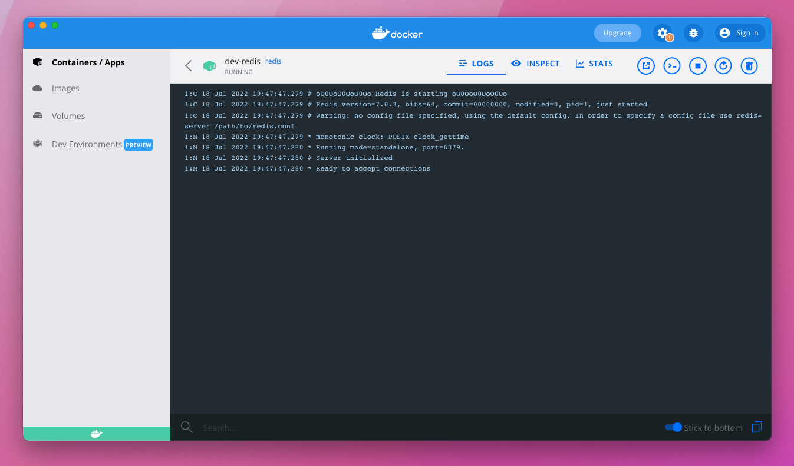
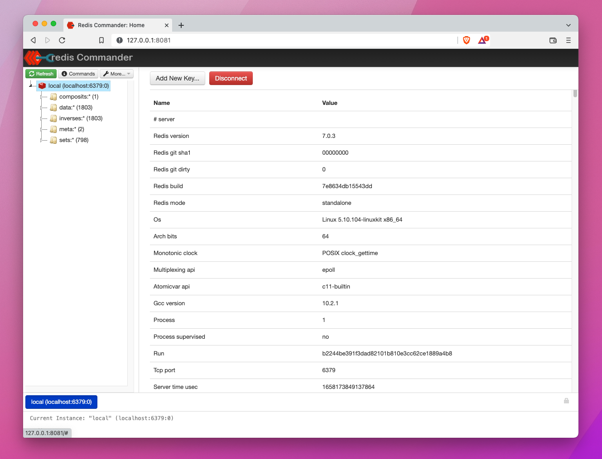
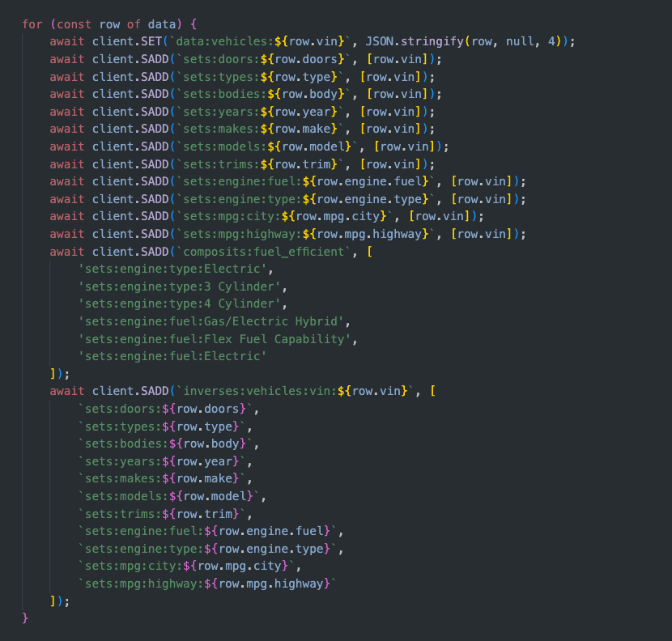
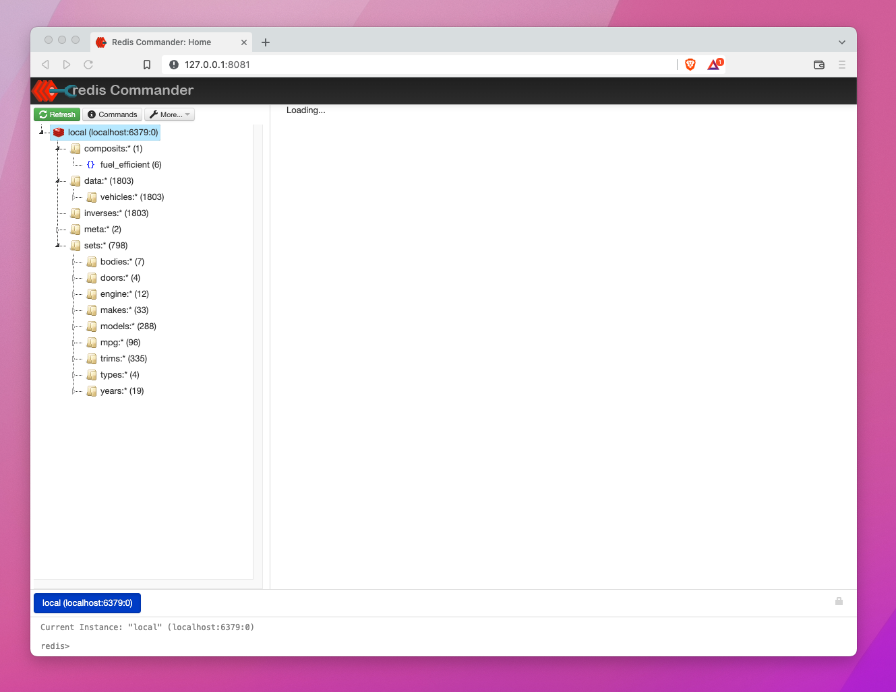
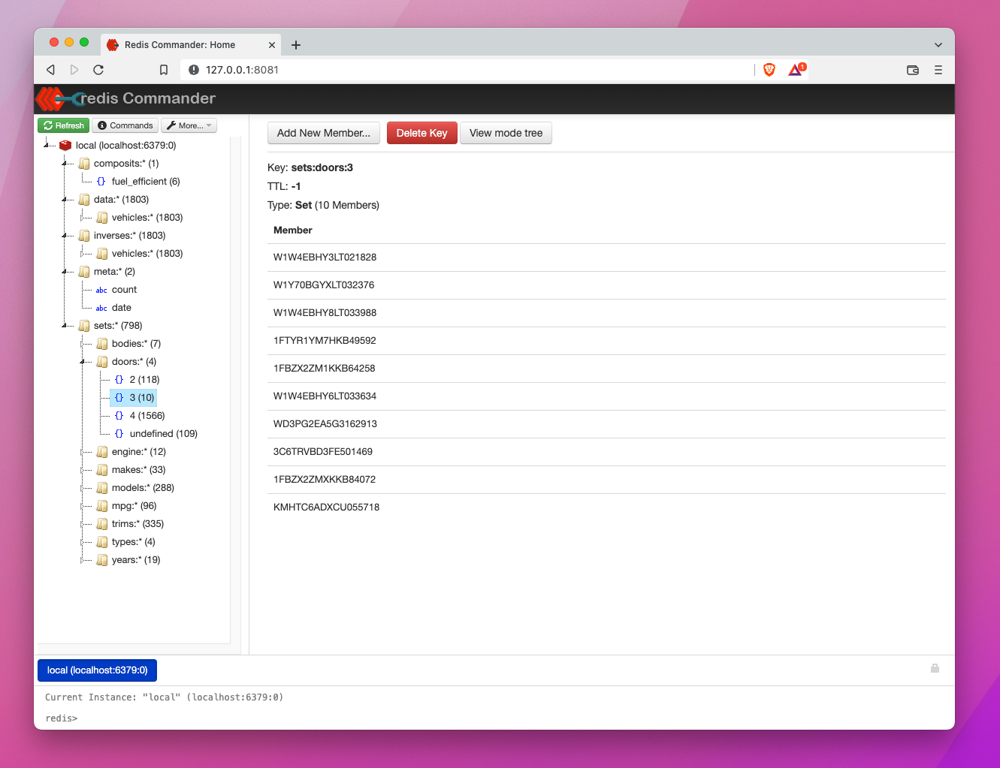
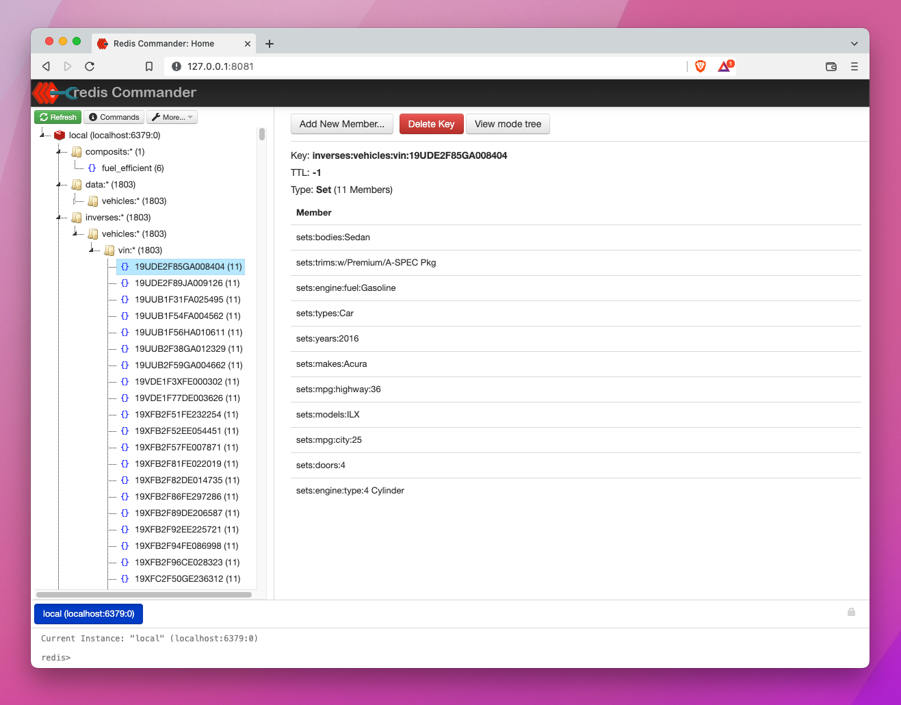
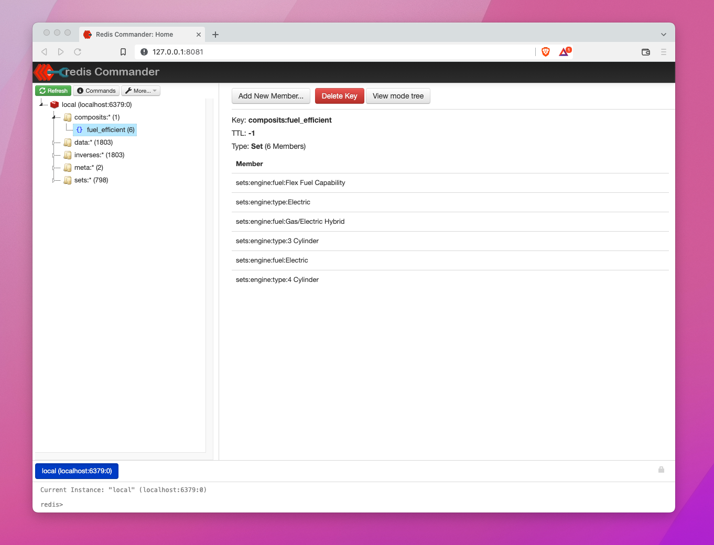
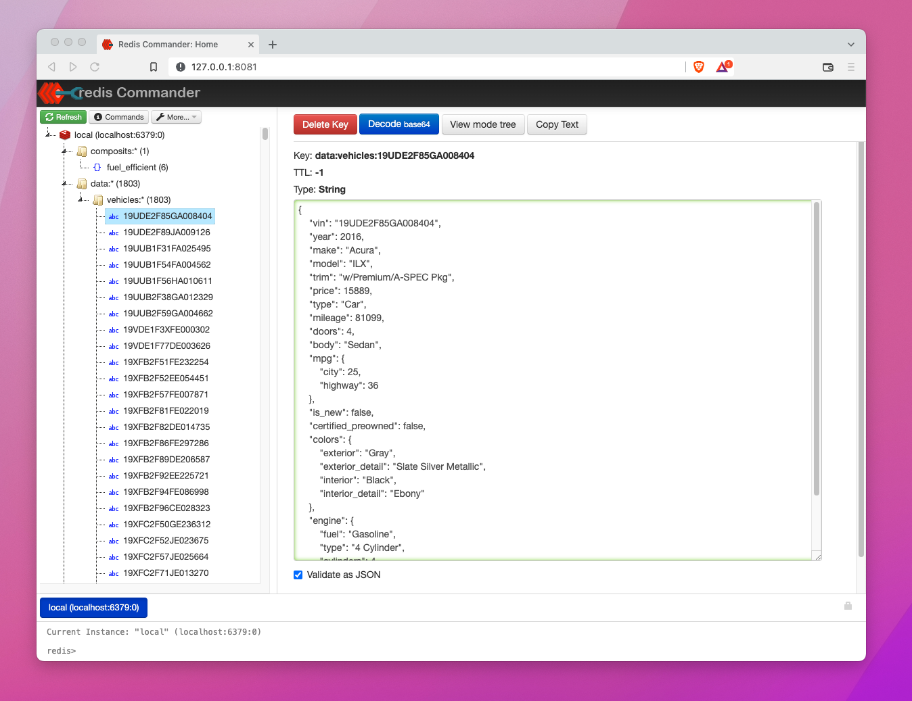
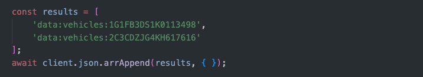

# Set Theory using Redis & Vehicles (Beginners)
Set Theory can be a deep and complex topic that may scare many away. Over the years I have found teaching the basic concepts can make this fun and useful in your daily life as an engineer.

This is a sample redis hydrator using generic vehicle data. In thie example we have two files:

- `database.json`: The vehicle database we will be searching, 1800 records.
- `loader.js`: Hydrates redis with sets based on the vehicle database. 

During this example, we will be using redis and basic set theory principles to search vehicles quickly.

### Important Terms

- **Set:** A unique list of values, belonging to a key.
- **Superset:** A set of sets.
- **Intersection:** The result of two or more sets joined, of only the values which belong to all sets. (No duplicates)
- **Union:** The result of two or more sets joined, containing the values from all sets. (No duplicates)
- **Inverse Sets:** A set containing keys, where the value is the key.

## 🔴 Getting Started

For this demo we need to start redis and hydrate data in the new searchable format.

1) Start Redis: `docker run -d --name dev-redis -p 6379:6379 -d redis`
2) Install Dependencies: `npm i`
3) Lastly, Hydrate Redis: `npm start`

First lets ensure docker is running...



Now we can start redis commander which is the tool we will use to look at the data.

4) Install: `npm install -g redis-commander`

## 🔴 Looking at the data

First off start Redis Commander by running `redis-commander` in the terminal. Once you have that running, navigate to: `localhost:8081` in a web browser and add a connection to `localhost:6379`. Now you should see your sets which we will be working with today.



Well how do we create these sets... well its actually quite simple and requires very little code. As you see below, we have a simple loop which puts data in the correct set by using a namespace string separated by the `:` character.  Thats really it. This current example is written in node, but Redis supports almost every language you could think of. 



**Note: Obviously the above code could be done in parallel but I kept it synchronous for ease of reading.**

Lets continue on...

### Duplicative Data & Lenses

You will immediately notice the duplicitive nature of this pattern, but this is absolutely intentional. Each set is a "lense" in which you look at the data. We trade response time, for storage cost, which is signifigantly cheaper.

We want as many sets, inverse sets, and supersets as possible. Ideally as many ways you might look at data, we want sets for each.

### Counts

Natively in each set and namespace, we have a length that is stored at write. We dont have to query for this, we can simply use a command or visually look at the amount of vehicles we have in each set! 



### Browsing a Set

Simply expanding out shows the heiarchy of a set's namespace by using a folder structure. In redis these are flat sets, but Redis Commander gives us a good visual. We can see in the following example that a simple set has a key and a list of values. In this case a list of all cars with three doors.



### Inverse Sets

Inverse sets are a great way to see what sets, another key is in. So instead of a Key and a bunch of values, you have values with a list of keys in each. For this example, we see a list of vins, and what sets this vin is found in!



### Composits or Supersets

Composits (or supersets) are essentially sets of sets. Lets take fuel efficency for example... What makes a vehicle fuel effient? Fuel Capacity? Electric Motors? 3 or 4 Cylendar engines? In the following example we create a composit called "fuel efficient" and within it we list the sets that contain vehicles with fuel efficent traits. We can use these to summarize business logic or grouping of data!



### Vehicle Data

A common pattern I like to implement, is the data namespace set. This is just a simple set where the key is a vin and the value is a json payload of the entire vehicle. I can use this for lookups as well!



## 🔴 Finding Data

Alright here is where the rubber hits the road: How do I use this data to create ultra high performant search/filter operations across this dataset? Lets get started...

### Your first Union

Lets say we want to get a list of vehicles which are in fact cars. We could have a composite set with the following sets within it: `` or we can query this using a union. Check it out:

Command: 
```
...
```
Result:
```
...
```


### Your first Intersection

Example: Lets say we want to limit our responses to all  2019 cars with two doors... What would that command look like? Well if we look we have sets for these attributes: 

```
sets:doors:*
sets:types:*
sets:years:*
```

So if we want to find our vehicle, we need to ensure we only return vin numbers that exist in **ALL THREE** of these sets right? (the order of the sets does not matter here)

Command: 
```
SINTER sets:doors:2 sets:types:Car sets:years:2019
```
Result:
```
1) "1G1FB3DS1K0113498"
2) "2C3CDZJG4KH617616"
3) "WMWXP7C59K2A49781"
4) "JN1AZ4EH0KM421666"
5) "3VWFD7ATXKM717101"
6) "1FA6P8CF4K5196010"
7) "1FA6P8TH5K5175362"
8) "2C3CDZAG0KH731743"
```

As we can see, we have 8 unique vins that exist in these three sets. Cool!

### Extra: Returning json single result

Information here...

### Extra: Returning json list results

So we have an array of vin numbers, well now we want to return this as an array of json payloads right? Thats why we have our `data:vehicles:*` set right?

To make this work youc an use a library, or a redis-cli module called: "[RedisJSON](https://redis.io/docs/stack/json/)" Which will let you essentially return them as an array of vehicles:

Command: 
```
JSON.ARRAPPEND data:vehicles:1G1FB3DS1K0113498 data:vehicles:2C3CDZJG4KH617616 $
```

But I would recommend doing this in code with a library, just make sure you do this union of values on the redis server, not in code. We dont want to hit redis once for each record 😛. Example:



## 🔴 Conclusion

You can use this pattern to easily build out complex search/filtering systems using basic set theory principles. 

Want to know more redis commands? [https://redis.io/commands/](https://redis.io/commands/)

If you want to know more about Set Theoryl This subject tends to be quite heavy, so I recommend watching these after this exercise. 

- https://www.youtube.com/watch?v=tyDKR4FG3Yw
- https://www.youtube.com/watch?v=xZELQc11ACY
- https://www.youtube.com/watch?v=4TlCToZZ5gA

Thanks!